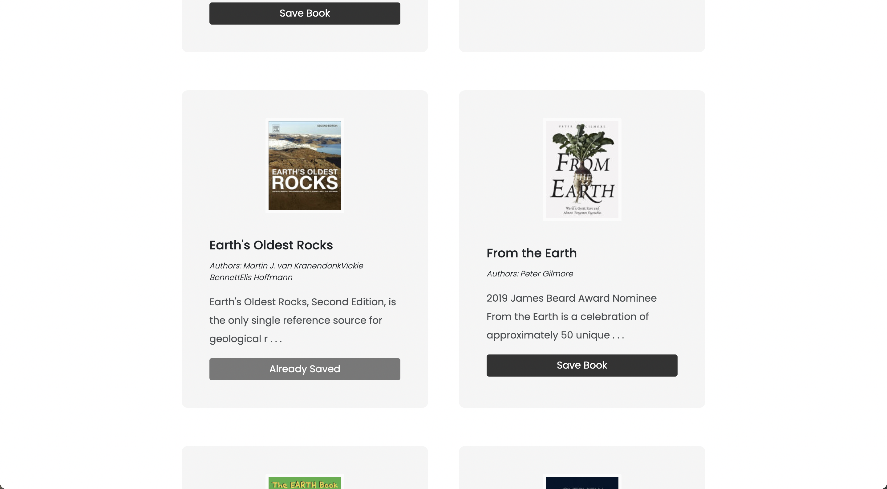
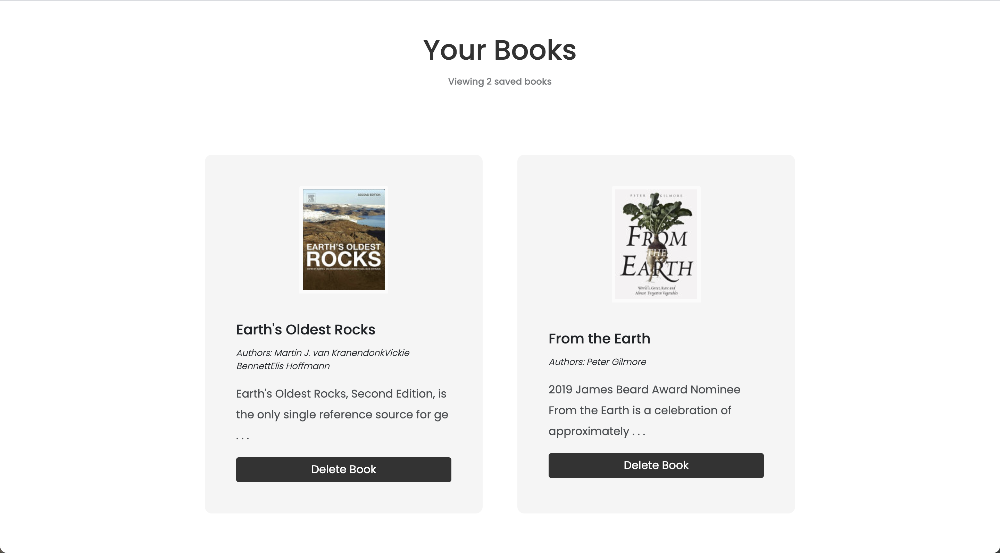

# Book-Search-Engine

A full-stack application built with React, Mongo and GraphQl | Deployed on Heroku 🔎

## Deployment

My Book Search Engine has been deployed here:
[Book Search Engine](https://punkinut-search.herokuapp.com/)

## Why make this?

My goal was to make a full stack application using GraphQl and Apollo Server to communicate with my Mongo Database. This allowed for a more fluent user experience due to the server side caching.

## My goal

I wanted to have a little fun by paying homage to google itself. All of my CSS and design inspiration came from the company and it makes sense after all due to the integration of their third party API. This app also includes authentication which allows you to even save your own books when you create an account!

## Home Page

The landing page of the web application

## Search Results

An example on how the search results load

## Personal Book Page

Here you can view all your saved books

## End note

I hope you enjoyed going through my third party API search engine :)
